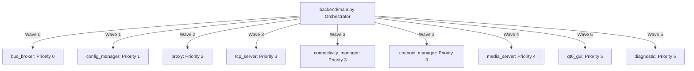
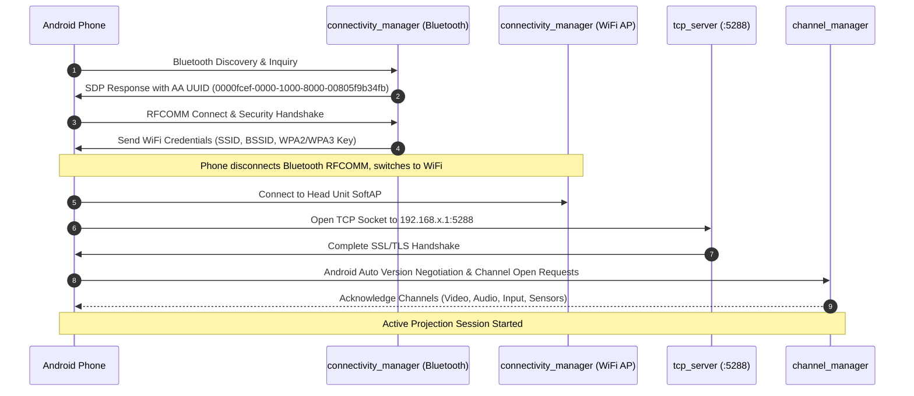

# NemoHeadUnit-Wireless

[](https://github.com/nemocrk/NemoHeadUnit-Wireless/actions/workflows/ci.yml)
[](https://www.python.org/)
[](#)
[](LICENSE)

**NemoHeadUnit-Wireless** is an enterprise-grade, modular, cross-platform software head unit for **Wireless Android Auto**, engineered for both embedded Linux automotive platforms (Raspberry Pi, Intel Atom, x86/ARM CarPCs) and native Windows environments.

It replaces monolithic head unit applications with an asynchronous, process-isolated microservice architecture managed by an intelligent multi-wave boot orchestrator, supporting both high-performance native Qt6 hardware-accelerated rendering and modern browser-based kiosk interfaces.

---

## Table of Contents

- [Key Highlights](#key-highlights)
- [System Architecture](#system-architecture)
  - [Priority Boot Waves](#priority-boot-waves)
  - [Active Module Catalog](#active-module-catalog)
  - [Dual Execution Modes (Multiprocessing vs Multithreading)](#dual-execution-modes)
- [Wireless Android Auto Protocol Flow](#wireless-android-auto-protocol-flow)
- [Media & Zero-Copy Rendering Pipelines](#media--zero-copy-rendering-pipelines)
  - [H.264 Video Transport (Shared Memory)](#h264-video-transport-shared-memory)
  - [Audio Architecture (AAC & PCM)](#audio-architecture-aac--pcm)
- [User Interface Ecosystem](#user-interface-ecosystem)
  - [Native Qt6 GPU Frontend (`qt6_gui`)](#native-qt6-gpu-frontend-qt6_gui)
  - [Web Browser Kiosk Shell (`frontend/`)](#web-browser-kiosk-shell-frontend)
- [Hardware Abstraction Layer (HAL)](#hardware-abstraction-layer-hal)
- [Directory Structure](#directory-structure)
- [Getting Started & Installation](#getting-started--installation)
  - [Prerequisites](#prerequisites)
  - [Micromamba Environment Setup](#micromamba-environment-setup)
  - [Running the Application](#running-the-application)
- [Production Automotive Deployment](#production-automotive-deployment)
  - [Linux Systemd Kiosk Service](#linux-systemd-kiosk-service)
  - [Linux APManager D-Bus Daemon](#linux-apmanager-d-bus-daemon)
  - [Automated Distribution Scripts](#automated-distribution-scripts)
- [Testing & Quality Assurance](#testing--quality-assurance)
- [License](#license)

---

## Key Highlights

* **Cross-Platform Native Execution**: Seamless operation on Linux (Wayland, X11, Headless) and native Windows without virtual machines or emulation layers.
* **Zero-Copy Shared Memory Video**: Sustained 60 FPS H.264 video rendering with sub-20ms latency via POSIX `/dev/shm` and Windows named memory maps.
* **Dual Execution Modes**: Switch instantly between process-isolated microservices (`multiprocessing` with ZeroMQ IPC) and ultra-lightweight thread-isolated workers (`multithreading` with In-Memory Bus Hub).
* **Hardware Abstraction Layer (HAL)**: Pluggable hardware drivers for Bluetooth (BlueZ D-Bus on Linux, Winsock SDP on Windows) and WiFi SoftAP management with mock fallback for testing.
* **Dual UI Engines**: Rich, native touch-optimized Qt6 desktop interface with hardware-accelerated OpenGL, and a responsive HTML5 / WebCodecs browser kiosk interface.
* **Enterprise CI/CD**: Automated GitHub Actions validation covering Ruff linting, Linux test matrix, Windows unit tests, and distribution package integrity.

---

## System Architecture



### Priority Boot Waves

Every module inherits from `BaseBackendModule` and implements strict lifecycle hooks (`setup()`, `run()`, `teardown()`). The orchestrator (`backend/main.py`) discovers and launches modules in sequentially verified priority waves:

```
Priority 0: bus_broker
       │
       ▼
Priority 1: config_manager
       │
       ▼
Priority 2: proxy
       │
       ▼
Priority 3: tcp_server, connectivity_manager, channel_manager
       │
       ▼
Priority 4: media_server
       │
       ▼
Priority 5: qt6_gui, diagnostic
```

### Active Module Catalog

| Module | Priority | Role | Endpoints & Interfaces |
| :--- | :---: | :--- | :--- |
| **`bus_broker`** | 0 | Core IPC Router | ZeroMQ XPUB/XSUB broker, `system.heartbeat` tracking, loopback registry. |
| **`config_manager`** | 1 | Settings Engine | Persistent YAML storage in OS AppData, schema validation, `/api/config` REST API. |
| **`proxy`** | 2 | Gateway Webserver | Reverse proxy on port `8000`, WebSockets, static file server for Web UI. |
| **`tcp_server`** | 3 | Android Auto Sockets | Port `5288` TLS listener, frame encapsulation, sequence tracking. |
| **`connectivity_manager`** | 3 | Radio & Discovery | Bluetooth RFCOMM discovery (`0000fcef-...`), WiFi SoftAP management via HAL. |
| **`channel_manager`** | 3 | Protocol Channels | AA Channel Multiplexer: Control, Video, Audio (Media/Speech/System), Mic, Input, Sensors. |
| **`media_server`** | 4 | Media Decoding | H.264 NAL parsing, SHM video frame writer, WebCodecs frame broadcaster. |
| **`qt6_gui`** | 5 | Native UI | Hardware-accelerated `QOpenGLWidget`, sliding drawer cards, `QAudioSink`. |
| **`diagnostic`** | 5 | System Health | Real-time message bus tracing, latency counters, memory profiling. |

---

### Dual Execution Modes

NemoHeadUnit-Wireless supports two execution modes switchable via CLI (`--mode multiprocessing|multithreading`) or the `NEMO_EXECUTION_MODE` environment variable:

| Feature | Multiprocessing (`--mode multiprocessing`) | Multithreading (`--mode multithreading`) |
| :--- | :--- | :--- |
| **Process Isolation** | Full OS process isolation (`subprocess.Popen`) | Single process, worker threads (`threading.Thread`) |
| **IPC Event Bus** | ZeroMQ XPUB/XSUB broker daemon | In-memory pub/sub hub (`InMemoryBusHub`), 0 ZMQ sockets |
| **Gateway Proxy** | `proxy` on port `8000` routing to loopback ports | `proxy` on port `8000` with direct in-memory route dispatch |
| **Inter-Module RPC** | Loopback HTTP `call_module()` | Direct coroutine dispatch (`_dispatch_inmemory_rpc`) |
| **Video Transport** | OS Shared Memory (`/dev/shm` / Windows named map) | In-memory bytearray ring buffers |
| **Use Case** | Multi-core automotive systems, crash resilience | Constrained embedded hardware, low-memory boards, debugging |

---

## Wireless Android Auto Protocol Flow

Connecting an Android smartphone wirelessly follows a strict multi-stage handshake:



---

## Media & Zero-Copy Rendering Pipelines

### H.264 Video Transport (Shared Memory)

To sustain high frame rates without CPU bottlenecks:
1. `channel_manager` extracts raw H.264 NAL units from encrypted packets.
2. `media_server` decodes the stream and writes raw video frames into an OS Shared Memory segment (`/dev/shm/nemo_video_frame` on Linux or named memory maps on Windows).
3. `qt6_gui` binds the shared memory pointer directly into OpenGL textures via `VideoViewportGL` (`QOpenGLWidget`), rendering at 60 FPS with zero memory copies.
4. For web clients, `media_server` feeds raw NAL frames over WebSocket to `frontend/js/video_renderer.js` using browser-native WebCodecs.

### Audio Architecture (AAC & PCM)

The audio pipeline separates audio into dedicated channels:
* **Media Audio**: High-bitrate music (AAC / 48kHz 16-bit stereo PCM).
* **Guidance / Speech**: Navigation directions and voice prompts (16kHz / 48kHz mono PCM).
* **System Alerts**: Ring tones and warnings.
* **Microphone Channel**: Uploads local microphone audio chunks back to the phone for Google Assistant speech recognition.
* **Audio Sinks**: Audio is rendered natively through Qt6 `QAudioSink` (WASAPI on Windows, PulseAudio/ALSA on Linux).

---

## User Interface Ecosystem

### Native Qt6 GPU Frontend (`qt6_gui`)
The primary automotive interface runs in `backend/modules/qt6_gui/`:
* **OpenGL Acceleration**: Frameless `QOpenGLWidget` video viewport with hardware texture mapping.
* **Sliding Drawer Architecture**: Smooth animated overlay cards that slide over active video without blocking projection:
  * **Bluetooth Drawer**: Live device pairing, signal strength, phone battery state.
  * **Phone Drawer**: PBAP contact hydration, dialer, active call cards with answer/hangup actions.
  * **Settings Drawer**: Resolution selection, mode toggling, audio device routing.
  * **Diagnostics Drawer**: Live bus latency monitors, frame drop counters.
  * **Logs Drawer**: Real-time loguru stream display.
* **Touch Event Injection**: Normalizes display touch events to Android Auto coordinates ($[0.0, 1.0]$) and dispatches them to `channel_manager` with sub-millisecond response times.

### Web Browser Kiosk Shell (`frontend/`)
The web frontend is served on port `8000`:
* Built using HTML5, CSS3, and modern JavaScript.
* Full-screen WebCodecs video canvas.
* 2x2 dashboard for disconnected state (navigation summary, active call, analog clock).
* Launchable in kiosk mode via `scripts/launch_kiosk.sh` (Linux) or `scripts/launch_kiosk.bat` (Windows).

---

## Hardware Abstraction Layer (HAL)

To ensure universal portability, hardware interactions are encapsulated behind abstract adapters (`backend/shared/hardware/`):

* **Bluetooth**:
  * **Linux**: `BlueZBluetoothAdapter` communicates with BlueZ over System D-Bus (`org.bluez`).
  * **Windows**: `WindowsBluetoothAdapter` uses native Winsock for AA UUID registration and RFCOMM communication.
  * **Mock**: `MockBluetoothAdapter` for automated unit testing and headless CI runs.
* **WiFi Access Point**:
  * **Linux**: Communicates with the unprivileged D-Bus daemon `org.nemo.APManager`.
  * **Windows**: `WindowsWifiApAdapter` utilizing WinRT APIs or mock driver.

---

## Directory Structure

```
NemoHeadUnit-Wireless/
├── pyproject.toml            # Project metadata, packaging, Ruff, Pytest config
├── environment.yml           # Linux micromamba environment specification
├── environment.windows.yml   # Windows environment specification
├── VERSION                   # Semantic version file (2.0.0)
├── main.py                   # Root application launcher (delegates to backend/main.py)
├── distribute.sh             # Linux deployment script wrapper
├── distribute.ps1            # Windows deployment script wrapper
│
├── backend/
│   ├── main.py               # Orchestrator (priority boot waves, process supervisor)
│   ├── shared/               # Shared libraries (IPC, HAL, config, logger, bus)
│   │   ├── base_module.py    # BaseBackendModule abstract class
│   │   ├── bus_client.py     # ZeroMQ / In-Memory PubSub client wrapper
│   │   ├── config_client.py  # Configuration synchronization client
│   │   ├── ipc_utils.py      # Cross-platform socket URI resolver
│   │   ├── logger.py         # Loguru logger with WebSocket log streaming
│   │   ├── proto_utils.py    # Android Auto framing & protobuf serialization
│   │   └── hardware/         # Hardware Abstraction Layer (HAL) adapters
│   └── modules/              # Process-isolated functional microservices
│       ├── bus_broker/       # Wave 0: IPC Message Bus & Heartbeat
│       ├── config_manager/   # Wave 1: Persistent YAML Configuration
│       ├── proxy/            # Wave 2: Gateway Reverse Proxy (Port 8000)
│       ├── tcp_server/       # Wave 3: Wireless AA TCP Listener (Port 5288)
│       ├── connectivity_manager/ # Wave 3: Bluetooth & WiFi AP Manager
│       ├── channel_manager/  # Wave 3: AA Channel Demultiplexer
│       ├── media_server/     # Wave 4: H.264 Video Decoder & SHM Buffer
│       ├── qt6_gui/          # Wave 5: Native Qt6 OpenGL User Interface
│       └── diagnostic/       # Wave 5: Live Telemetry & Bus Diagnostics
│
├── frontend/                 # HTML5/CSS3/WebCodecs Web Kiosk UI
│   ├── index.html            # Primary web interface
│   ├── css/                  # Styling & themes
│   └── js/                   # WebCodecs video decoder & audio player
│
├── packaging/                # Debian/Arch Linux packaging & systemd service units
├── services/                 # Platform services (Linux APManager D-Bus daemon)
├── scripts/                  # Distribution tools, kiosk launchers, hardware diagnostics
├── tests/                    # Comprehensive unit, integration, and e2e test suite
└── docs/                     # Architecture guides, UI design systems, roadmaps
```

---

## Getting Started & Installation

### Prerequisites

* Python 3.13+
* [Micromamba](https://mamba.readthedocs.io/en/latest/installation/micromamba-installation.html) (recommended) or Conda
* Linux: System D-Bus, BlueZ, ZeroMQ (`libzmq3-dev`, `dbus`, `libglib2.0-dev`)
* Windows: PowerShell 5.1+ or PowerShell 7+

### Micromamba Environment Setup

```bash
# 1. Clone repository
git clone https://github.com/nemocrk/NemoHeadUnit-Wireless.git
cd NemoHeadUnit-Wireless

# 2. Create environment from specification
# On Linux:
micromamba create -f environment.yml -y
# On Windows:
micromamba create -f environment.windows.yml -y

# 3. Activate environment
micromamba activate NemoHeadUnit-Wireless
```

### Running the Application

```bash
# Launch default (Multiprocessing mode with Qt6 GUI):
python main.py

# Launch in lightweight Multithreading mode:
python main.py --mode multithreading

# Launch headless (Web UI only on http://localhost:8000):
python main.py --headless

# Launch on custom public port:
python main.py --port 8080
```

---

## Production Automotive Deployment

### Linux Systemd Kiosk Service

Install NemoHeadUnit as a system background service that auto-starts on boot:

```bash
# Copy systemd unit
sudo cp packaging/nemo-kiosk.service /etc/systemd/system/
sudo systemctl daemon-reload
sudo systemctl enable nemo-kiosk.service
sudo systemctl start nemo-kiosk.service
```

### Linux APManager D-Bus Daemon

To manage WiFi SoftAP interfaces without granting root permissions to the main application:

```bash
# Run installer (sets up D-Bus policies and polkit rules)
sudo bash services/linux/ap_manager_service/install.sh
```

### Automated Distribution Scripts

Deploy to remote automotive targets over SSH automatically:

```bash
# Deploy to remote target via SSH:
./distribute.sh nemo@192.168.1.50 --restart

# Deploy on Windows host:
.\distribute.ps1 -Local -Restart
```

---

## Testing & Quality Assurance

NemoHeadUnit-Wireless enforces high quality standards with Pytest, Ruff, and GitHub Actions:

```bash
# Run code linting & format checks:
ruff check .
ruff format --check .

# Run unit and integration tests:
pytest -m "unit or integration or e2e_smoke"

# Run with coverage:
pytest --cov=backend --cov-report=term-missing
```

---

## License

This project is licensed under the MIT License. See [LICENSE](LICENSE) for details.
