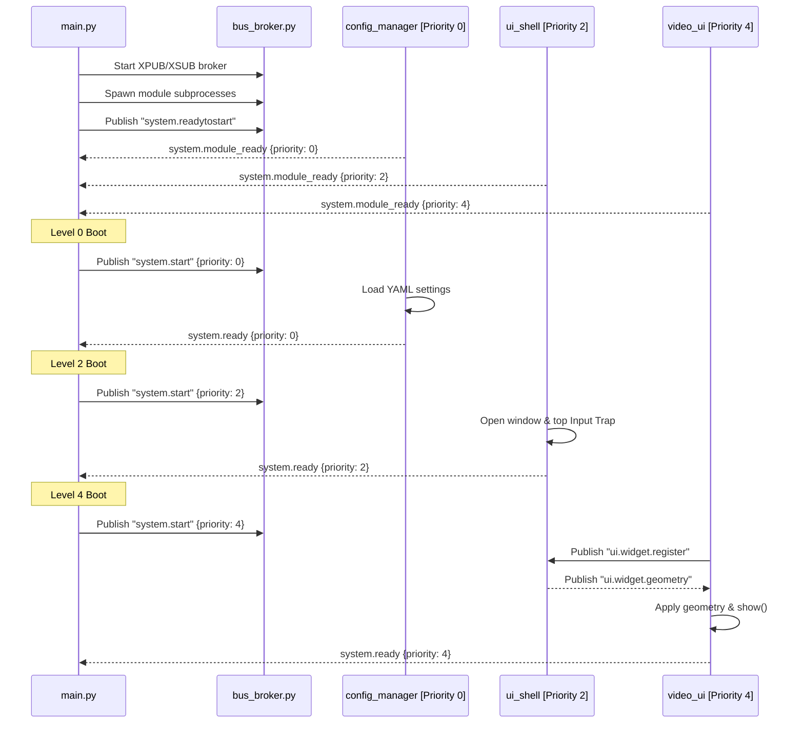

# NemoHeadUnit-Wireless


NemoHeadUnit-Wireless is an emulation platform that runs an Android Auto™ wireless headunit experience on resource-constrained edge devices. Written in pure Python 3.14, the system handles wireless pairing, network handshakes, dynamic UI composition, and hardware-accelerated video/audio rendering—**completely eliminating C++ compiler dependencies and toolchain complexity.**

---

## 🚀 Key Architectural Innovations

Traditional headunit architectures suffer from CPU contention, thread deadlock, and GIL (Global Interpreter Lock) bottlenecking when simultaneously decoding $60\text{ fps}$ video, routing PCM audio, and handling high-frequency touch screen inputs. 

NemoHeadUnit-Wireless solves these constraints using a series of innovative software design patterns:

### 1. GIL-Isolated Multi-Process Topography
Rather than running all modules in a single event loop, each major subsystem runs as an independent OS process. If a widget crashes, the rest of the system (including active audio projection and control sockets) continues running.
- **Orchestration**: `main.py` discovers module processes dynamically and coordinates a reactive priority-based boot sequence (from configuration manager up to visual widgets).
- **Communication**: Processes communicate exclusively through a central ZeroMQ (ZMQ) XPUB/XSUB broker (`bus_broker.py`). No Python object references cross process boundaries.

### 2. The Input Trap Pattern
Because each UI widget runs as a separate process with its own transparent PyQt6 window, routing touch inputs is a major challenge. The system addresses this with a global input dispatcher:
1. **Overlay capture**: `ui_shell` spawns an invisible, frameless `InputTrap` window that floats on top of the entire screen ($z = \infty$).
2. **Event serialization**: `InputTrap` captures 100% of touch and mouse coordinates and publishes them as raw events (`input.raw`).
3. **Geometry Hit-Testing**: `ui_shell` subscribes to raw inputs, runs a collision hit-test against the registered geometries of the widgets, and calculates local offsets relative to the target widget's origin:
   $$\begin{aligned}
   x_{\text{local}} &= x_{\text{global}} - x_{\text{widget\_left}} \\
   y_{\text{local}} &= y_{\text{global}} - y_{\text{widget\_top}}
   \end{aligned}$$
4. **Targeted Dispatch**: The translated coordinates are routed to `input.event.<widget_name>`, allowing the target process to react locally (e.g., triggering button hover states).

```
User Touch/Click
       │
       ▼
┌──────────────────────────────────────────────┐
│       InputTrap Window (z = infinity)        │
└──────────────────────┬───────────────────────┘
                       │ input.raw (ZMQ)
                       ▼
┌──────────────────────────────────────────────┐
│             ui_shell Compositor              │
│  (Hit-tests coordinates & translates offset)  │
└──────────────────────┬───────────────────────┘
                       │ input.event.navbar_ui (ZMQ)
                       ▼
┌──────────────────────────────────────────────┐
│        Target Process (e.g., navbar_ui)      │
└──────────────────────────────────────────────┘
```

### 3. Declarative UI Reflow Compositor
Widgets do not hardcode screen coordinates. Instead, they announce layout constraints (e.g., `dock: "bottom"`, `height: 60`, `min_height: 48`) via the `ui.widget.register` topic. `ui_shell` automatically reflows coordinates, handles z-order stacking, and pushes geometry configurations down to individual windows.

### 4. Zero-Copy Media Transport
To bypass JSON string processing and Base64 parsing overhead, media streams (AAC audio, H.264 video) travel as **2-Frame ZMQ Multipart Messages**:
- **Frame 0 (Topic)**: Routing key (bytes).
- **Frame 1 (Payload)**: A raw byte array passed directly via memoryviews to Python bindings for GStreamer, minimizing CPU copying.

---

## 📂 Repository Directory Tour

```
.
├── main.py                     # Orchestrator (spawns modules and coordinates priority boot)
├── bus_broker.py               # ZeroMQ XPUB/XSUB IPC message broker
├── shared/                     # Reusable utilities shared across isolated processes
│   ├── bus_client.py           # Instrumented ZMQ IPC wrapper (injects telemetry & latency metrics)
│   ├── config_client.py        # Schema-first configuration validation library
│   ├── logger.py               # Loguru-based logger with a thread-safe ZMQ bus drain sink
│   └── proto_utils.py          # Android Auto wire-format frame encoders and decoders
│
├── modules/                    # Isolated OS-level process modules
│   ├── config_manager/         # Central config manager; persists settings to YAML
│   ├── ui_shell/               # Composer layout manager and Input Trap coordinate translator
│   ├── navbar_ui/              # Bottom playback progress bar
│   ├── floating_menu_ui/       # Settings launcher displaying dynamic arc-shaped widget buttons
│   ├── bluetooth_ui/           # Bluetooth pairing manager overlay
│   ├── config_ui/              # Dynamic UI settings configuration editor
│   ├── video_ui/               # GStreamer H.264 projection renderer (hardware accelerated)
│   │
│   ├── channel_manager/        # Coordinates Open Android Auto stream session channels
│   ├── oaa_control_channel/    # Implements OAA handshakes, control commands, and serialization
│   └── channel_modules/        # Specific stream encoders (audio, video, input, sensor, wifi)
│
└── tests/                      # Core test suites (Unit, Integration, E2E, Fuzz)
    ├── conftest.py              # In-process ZMQ broker and offscreen QApp fixtures
    └── e2e/helpers/             # Stack launchers and PhoneMock RFCOMM/TCP socket simulators
```

---

## 🛠️ Technical Stack Summary

| Layer | Component | Details |
|---|---|---|
| **Core** | Language | Python 3.14 (running in a `conda` sandbox environment) |
| **OS** | Deployment Target | Ubuntu 24 (optimized for embedded platforms) |
| **Bus** | IPC Broker | ZeroMQ XPUB/XSUB sockets (`pyzmq` over Unix domain sockets) |
| **Serialization** | Format | JSON (control messages) + Raw Binary Multipart (media frames) |
| **UI** | Compositor | PyQt6 (with Alpha-channel transulency and hardware GLSL shaders) |
| **Media** | Video Decoding | PyGObject GStreamer binding (hardware accelerated decoding) |
| **Audio** | Sound Mixing | PulseAudio / PipeWire device mapping (`pacat` process streams) |

---

## ⚙️ How the System Starts Up

NemoHeadUnit-Wireless initiates a reactive handshake to ensure background services are ready before UI panels register.



---

## 🧪 Verification & Simulation Suite

The repository contains an E2E simulation harness capable of mimicking a physical Android device to verify connection logic headlessly:
- **`PhoneMock`**: Simulates Bluetooth RFCOMM pairing and negotiates Wi-Fi AP association.
- **`TcpPhoneClient`**: Establishes a virtual OAA TCP socket, completing Version exchanges and Channel openings.
- **`StackLauncher`**: Spins up the entire Headunit stack inside thread-safe daemon processes to test session restarts.

### Running Verification Locally

```bash
# Install testing dependencies
pip install -e ".[test]"

# Run Unit & Integration tests (enforcing minimum 80% coverage)
pytest -m "unit or integration" --cov=. --cov-report=term-missing --cov-fail-under=80

# Run headless E2E connection checks
pytest -m e2e_smoke -v
```

---

## 📖 Comprehensive Documentation Index

For in-depth explanations of individual subsystems, consult our documentation suite:

- 📐 **[System Architecture](docs/SYSTEM_ARCHITECTURE.md)**: Multi-process isolation, telemetry, and graceful shutdown sequence barriers.
- 🧩 **[Design Patterns](docs/DESIGN_PATTERNS.md)**: Boot handshake protocols, registration contracts, and Input Trap hit-testing.
- ⚙️ **[Functional Targets](docs/FUNCTIONAL_TARGETS.md)**: Bluetooth/Wi-Fi credential negotiations, GStreamer decoders, and audio mixing.
- 🖥️ **[UI Compositor Architecture](docs/UI_ARCHITECTURE.md)**: Multi-process transparent window configurations and ZMQ routing.
- 🎨 **[UI Design System Specification](docs/UI_DESIGN_SYSTEM.md)**: Colors, typography scale, Lucide icons, and motion guidelines.
- 🧪 **[Test Suite Architecture](docs/TEST_SUITE_ARCHITECTURE.md)**: Unit, integration, E2E, fuzz, and performance testing methodologies.
