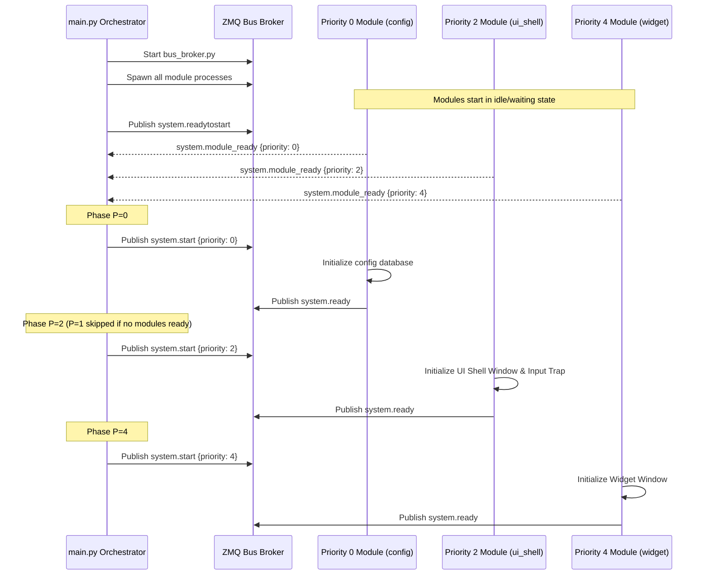
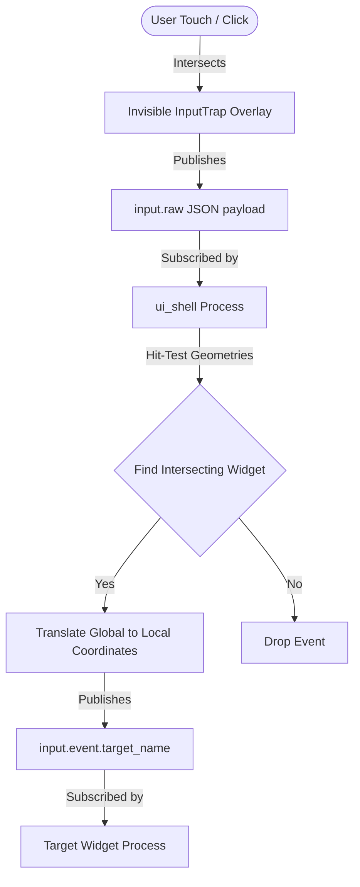

# Software Design Patterns Guide — NemoHeadUnit-Wireless V2

This document details the software design patterns and protocols that enable modularity, seamless UI composition, and multi-process input orchestration in NemoHeadUnit-Wireless V2.

---

## 1. Module Autodiscovery & Reactive Boot Protocol

NemoHeadUnit-Wireless V2 avoids hardcoded lists of modules. Instead, it employs an **Autodiscovery Pattern** combined with a **Reactive Boot Protocol** to load and coordinate system processes.

### Autodiscovery Mechanism
The main orchestrator (`main.py`) dynamically scans the `modules/` directory at startup:
- Any subdirectory containing a `main.py` file is recognized as an active module.
- Folders with names starting with an underscore (e.g., `_template/`) are explicitly ignored.
- To disable a module without deleting it, rename its entry point to `main.py.disabled`.

### The Reactive Boot Protocol
Because modules depend on each other (e.g., UI widgets require the configuration manager and the UI shell to be fully operational), startup is governed by a reactive handshake protocol over ZMQ:



---

## 2. Declarative UI Registration Pattern

Rather than a hardcoded UI grid or static layout files, widgets register themselves dynamically using a **Declarative Registration Pattern** over the message bus.

### Widget Registration Contract
When a UI process starts, it publishes a registration payload to the `ui.widget.register` topic:

```json
{
  "name": "navbar_ui",
  "z_order": 2,
  "dock": "bottom",
  "height": 60,
  "min_height": 48,
  "max_height": 80
}
```

For transient, on-demand modules (such as settings, bluetooth pairings, or floating control panels), the payload declares itself as `on_request`:

```json
{
  "name": "config_ui",
  "z_order": 3,
  "dock": "center",
  "width": 500,
  "height": 400,
  "on_request": true,
  "menu_order": 2,
  "icon": "⚙️"
}
```

### Layout Calculation (`_reflow`)
The `ui_shell` layout engine aggregates registration payloads and calculates boundaries using a screen reflow algorithm:
1. **Z-Order Ordering**: Group widgets by `z_order` and process layers.
2. **Dock Allocations**:
   - `top` / `bottom` widgets are assigned full width, deducting their height from the screen's vertical layout offsets.
   - `left` / `right` widgets are assigned full remaining height, deducting their width from horizontal layout offsets.
   - `center` widgets are centered in the remaining viewport.
3. **Geometry Distribution**:
   - `ui_shell` publishes `ui.widget.geometry` containing `{name, x, y, w, h, dpi_factor}` for each modified widget.
   - The corresponding widget process receives its geometry update and resizes its transparent borderless window to fit the coordinates.

---

## 3. The Input Trap Pattern

A major challenge in multi-process UI environments is input routing. Since each widget runs as a separate process with its own PyQt6 window, clicks and touch coordinates on transparent areas of an upper window would normally either be swallowed or miss the target window beneath.

NemoHeadUnit-Wireless V2 solves this using the **Input Trap Pattern**:



### The Input Trap Overlay
1. **Visual Transparency**: `ui_shell` spawns two windows:
   - `ShellWindow`: The dark base backdrop.
   - `InputTrap`: A frameless, completely transparent window configured with `Qt.WindowType.WindowStaysOnTopHint`.
2. **Global Event Capture**:
   - Because `InputTrap` sits on top of all other windows, it captures **100% of screen mouse and touch events** (press, release, move).
   - It intercepts these events and publishes them to `input.raw`:
     ```json
     {
       "type": "press",
       "x_global": 420,
       "y_global": 570,
       "timestamp": 1716730821500
     }
     ```

### Coordinator Hit-Testing & Coordinate Translation
`ui_shell` subscribes to `input.raw` and handles routing:
1. **Geometry Hit-Test**: It runs a collision check using global coordinates against all active widget geometries, starting from the highest `z_order` down to `0`.
2. **Translation to Local Coordinates**: Once a hit target is identified (e.g., `navbar_ui`), it calculates coordinates relative to that widget's top-left corner:
   $$\begin{aligned}
   x_{\text{local}} &= x_{\text{global}} - x_{\text{widget\_start}} \\
   y_{\text{local}} &= y_{\text{global}} - y_{\text{widget\_start}}
   \end{aligned}$$
3. **Event Dispatch**:
   - It publishes an event payload to `input.event.navbar_ui`.
   - The `navbar_ui` process subscribes to this topic, parses the local coordinates, and triggers button hover/click state animations in its own independent thread.
