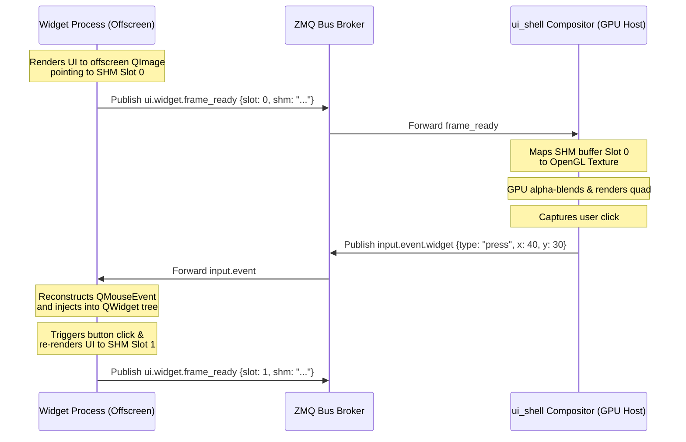

# Shared-Memory GPU Compositor Architecture (V3) — Spec

## Overview
This document specifies the V3 **Shared-Memory GPU Compositor Architecture** for NemoHeadUnit-Wireless. This architecture achieves absolute platform independence (Windows, X11, Wayland) by running all widget processes completely offscreen (headless) and compositing their frames using shared memory and GPU texture mapping inside a single host window.



---

## 1. Shared-Memory Buffer Layout
Each widget process allocates a named shared memory block (`multiprocessing.shared_memory.SharedMemory`) representing a flat array of fixed-size slots for double-buffering.

### Memory Layout
For a widget of dimension $W \times H$ in `ARGB32` format (4 bytes per pixel):
$$\text{Slot Size} = W \times H \times 4 \text{ bytes}$$
$$\text{Total Block Size} = \text{Slot Size} \times 2 \text{ bytes (Double-buffered)}$$

* **Slot 0**: Offset `0` to `Slot Size - 1`
* **Slot 1**: Offset `Slot Size` to `Slot Size * 2 - 1`

---

## 2. Bus Protocol Specification

### A. Widget Registration (`ui.widget.register`)
Published by the widget upon initialization:
```json
{
  "name": "navbar_ui",
  "z_order": 2,
  "dock": "bottom",
  "width": 1024,
  "height": 60,
  "format": "ARGB32",
  "shm_name": "shm_navbar_84920",
  "on_request": false
}
```

### B. Frame Ready Notification (`ui.widget.frame_ready`)
Published by the widget whenever a new frame is drawn and ready for compositor upload:
```json
{
  "name": "navbar_ui",
  "shm_name": "shm_navbar_84920",
  "w": 1024,
  "h": 60,
  "format": "ARGB32",
  "active_slot": 0,
  "timestamp_ms": 1748257012345
}
```

### C. Input Event Routing (`input.event.<widget_name>`)
Published by the compositor to route mouse/touch inputs:
```json
{
  "type": "press",
  "x": 42,
  "y": 15,
  "button": 1,
  "buttons": 1,
  "modifiers": 0,
  "timestamp_ms": 1748257012390
}
```

---

## 3. Widget-Side Implementation (Offscreen Rendering & Event Injection)

### A. Offscreen Rendering Loop
The widget paints to a virtual surface using a `QImage` wrapper around the raw shared memory buffer:

```python
from PyQt6.QtGui import QImage, QPainter
from multiprocessing import shared_memory

class OffscreenWidgetEngine:
    def __init__(self, name, w, h):
        self.name = name
        self.w = w
        self.h = h
        self.slot_size = w * h * 4
        
        # Allocate double-buffered Shared Memory
        self.shm = shared_memory.SharedMemory(name=f"shm_{name}_{int(time.time())}", create=True, size=self.slot_size * 2)
        self.active_slot = 0

    def render_widget(self, root_widget):
        # Determine write slot
        write_slot = 1 - self.active_slot
        offset = write_slot * self.slot_size
        
        # Wrap SHM slice in zero-copy QImage
        buffer_slice = self.shm.buf[offset : offset + self.slot_size]
        img = QImage(buffer_slice, self.w, self.h, QImage.Format.Format_ARGB32)
        
        # Paint widget tree into QImage
        img.fill(0) # transparent backdrop
        painter = QPainter(img)
        root_widget.render(painter)
        painter.end()
        
        # Swap slots and notify compositor
        self.active_slot = write_slot
        bus.publish("ui.widget.frame_ready", {
            "name": self.name,
            "shm_name": self.shm.name,
            "w": self.w,
            "h": self.h,
            "format": "ARGB32",
            "active_slot": self.active_slot
        })
```

### B. Event Reconstruction
Offscreen widgets receive ZMQ coordinate messages and inject them using standard Qt API calls:

```python
from PyQt6.QtCore import QPointF, Qt, QEvent
from PyQt6.QtGui import QMouseEvent
from PyQt6.QtWidgets import QApplication

def on_input_event(topic: str, payload: dict) -> None:
    if root_window is None:
        return
        
    ev_type = payload["type"]
    local_pos = QPointF(payload["x"], payload["y"])
    
    # Map ZMQ parameters to Qt types
    qt_type = {
        "press": QEvent.Type.MouseButtonPress,
        "move": QEvent.Type.MouseMove,
        "release": QEvent.Type.MouseButtonRelease
    }[ev_type]
    
    button = Qt.MouseButton(payload.get("button", 0))
    buttons = Qt.MouseButton(payload.get("buttons", 0))
    modifiers = Qt.KeyboardModifier(payload.get("modifiers", 0))
    
    # Reconstruct mouse event
    qt_event = QMouseEvent(
        qt_type,
        local_pos,
        local_pos,  # offscreen window treats local as global
        button,
        buttons,
        modifiers
    )
    
    # Inject directly into Qt's event queue (thread-safe)
    QApplication.postEvent(root_window, qt_event)
```

---

## 4. Compositor-Side Implementation (QOpenGLWidget Compositing)

The `ui_shell` compositor draws the combined quads. For each registered widget, it allocates an OpenGL texture. Upon receiving `ui.widget.frame_ready`, it maps the shared memory slot and updates the texture:

```python
from PyQt6.QtOpenGLWidgets import QOpenGLWidget
from OpenGL import GL

class CompositorGLCanvas(QOpenGLWidget):
    def __init__(self):
        super().__init__()
        self.widgets = {} # name -> WidgetGLRecord
        
    def paintGL(self):
        GL.glClear(GL.GL_COLOR_BUFFER_BIT)
        GL.glEnable(GL.GL_BLEND)
        GL.glBlendFunc(GL.GL_SRC_ALPHA, GL.GL_ONE_MINUS_SRC_ALPHA)
        
        # Draw widgets in ascending Z-order
        for name, record in sorted(self.widgets.items(), key=lambda x: x[1].z_order):
            if not record.visible or not record.texture_id:
                continue
            
            GL.glBindTexture(GL.GL_TEXTURE_2D, record.texture_id)
            self.draw_textured_quad(record.x, record.y, record.w, record.h)

    def update_frame(self, name, shm_name, w, h, active_slot):
        record = self.widgets.get(name)
        if not record:
            return
            
        # Attach to shared memory block if not already mapped
        if not record.shm or record.shm.name != shm_name:
            record.shm = shared_memory.SharedMemory(name=shm_name)
            
        # Calculate offset
        slot_size = w * h * 4
        offset = active_slot * slot_size
        pixel_data = record.shm.buf[offset : offset + slot_size]
        
        # Upload buffer to GPU
        self.makeCurrent()
        GL.glBindTexture(GL.GL_TEXTURE_2D, record.texture_id)
        GL.glTexSubImage2D(
            GL.GL_TEXTURE_2D, 0, 0, 0, w, h,
            GL.GL_BGRA, GL.GL_UNSIGNED_BYTE, pixel_data
        )
        self.doneCurrent()
        self.update() # triggers paintGL redraw
```

---

## 5. Architectural Benefits
1. **100% Platform Independent**: Works exactly the same way on Windows, X11, and Wayland without utilizing OS-specific window nesting protocols.
2. **True GIL Isolation**: Every widget's render pipeline runs inside its own Python process. The compositor only handles fast GPU texture drawing.
3. **No Focus Theft**: Widgets have no native display window, preventing them from appearing in Alt+Tab menus or intercepting global keystrokes.
4. **Clean Crash Recovery**: If a widget crashes, the compositor simply deletes its texture and skips rendering, preventing systemic application hangs.
