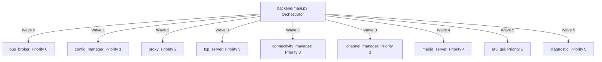

# System Architecture Guide — NemoHeadUnit-Wireless V2

This document details the architectural design of the **NemoHeadUnit-Wireless V2** platform. It describes the priority boot sequence, intra-module communications (ZeroMQ IPC vs. In-Memory Hub), zero-copy Shared Memory (SHM) video pipeline, hardware abstraction layer (HAL), and the Qt6 unified frontend.

---

## 1. Process & Thread Orchestration

NemoHeadUnit-Wireless is designed around independent, loosely-coupled microservices running either as **isolated operating system processes** (Multiprocessing mode) or as **thread-isolated workers** (Multithreading mode), orchestrated by `backend/main.py`.



### Multi-Wave Priority Boot Sequence

The orchestrator discovers modules adhering to `BaseBackendModule` and launches them in strictly ordered boot waves:

```
Wave 0: bus_broker (IPC message routing & heartbeat registry)
   │
   ▼
Wave 1: config_manager (Persistent YAML store in OS AppData & /api/config)
   │
   ▼
Wave 2: proxy (Gateway webserver listening on port 8000)
   │
   ▼
Wave 3: tcp_server, connectivity_manager, channel_manager (Wireless AA protocols & sockets)
   │
   ▼
Wave 4: media_server (H.264 video decoding, WebCodecs streaming & SHM frame buffer)
   │
   ▼
Wave 5: qt6_gui, diagnostic (Native Qt6 OpenGL UI & runtime health diagnostics)
```

### Priority Wave Breakdown

| Wave | Priority | Modules | Purpose & Responsibilities |
|---|---|---|---|
| **0** | `0` | `bus_broker` | Autonomous ZeroMQ XPUB/XSUB router and heartbeat registry (`system.heartbeat`). Runs without external config dependencies. |
| **1** | `1` | `config_manager` | Reads/writes persistent YAML config in OS user AppData (`~/.config/NemoHeadUnit-Wireless/` on Linux, `%APPDATA%\NemoHeadUnit-Wireless\` on Windows), validates schemas, exposes `/api/config`. |
| **2** | `2` | `proxy` | Gateway HTTP/WebSocket reverse proxy listening on port `8000`, routing `/api/<module>` to internal service ports. |
| **3** | `3` | `tcp_server` | Wireless Android Auto TCP listener on port `5288`, handling SSL/TLS connection negotiation and raw frame framing. |
| **3** | `3` | `connectivity_manager` | Bluetooth discovery, SDP registration (`0000fcef-...`), RFCOMM handshake, and WiFi SoftAP lifecycle management. |
| **3** | `3` | `channel_manager` | Android Auto channel multiplexer: Control, Video, Audio (Media, Speech, System), Microphone, Touch Input, and Sensors. |
| **4** | `4` | `media_server` | Video pipeline: NAL packet parsing, H.264 decoding, Shared Memory (`/dev/shm`) zero-copy ring buffer, WebCodecs bridge. |
| **5** | `5` | `qt6_gui` | Native Qt6 touch user interface with hardware-accelerated `QOpenGLWidget`, sliding drawer navigation, and audio playback (`QAudioSink`). |
| **5** | `5` | `diagnostic` | Live health monitoring, bus message tracing, latency tracking, and system performance metrics. |

---

## 2. Dual Execution Modes

NemoHeadUnit-Wireless supports two execution modes switchable via CLI (`--mode multiprocessing|multithreading`) or environment variable (`NEMO_EXECUTION_MODE`):

| Characteristic | Multiprocessing (`--mode multiprocessing`) | Multithreading (`--mode multithreading`) |
| :--- | :--- | :--- |
| **Isolation** | Process-isolated (`subprocess.Popen`) | Thread-isolated (`threading.Thread`) |
| **Event Bus** | ZeroMQ XPUB/XSUB broker daemon | In-memory pub/sub hub (`InMemoryBusHub`), zero ZMQ sockets |
| **Public Gateway** | `proxy` on port `8000` | `proxy` on port `8000` |
| **Inter-Module RPC** | HTTP `call_module()` via loopback | In-memory coroutine dispatch (`_dispatch_inmemory_rpc`) |
| **Video Transport** | OS Shared Memory (`/dev/shm/nemo_video_frame`) | Thread-safe in-memory ring buffers |
| **Crash Blast Radius** | Single-module fault isolation | Lightweight resource footprint (ideal for embedded) |

---

## 3. Communication & Messaging Bus

### ZeroMQ XPUB/XSUB (`bus_broker`)
In Multiprocessing mode, `bus_broker` routes all intra-module messages:
- **XSUB Socket**: Receives publications from all module `BusClient` instances.
- **XPUB Socket**: Distributes published topics to all subscribed clients.
- **Cross-Platform Addressing**: Resolved dynamically by `backend/shared/ipc_utils.py` (POSIX domain sockets `ipc:///tmp/nemobus_v2.*` on Linux, TCP loopback `tcp://127.0.0.1:*` on Windows).
- **High Water Mark (HWM)**: Set to `5000` with non-blocking drops to prevent backpressure stalls.

### Heartbeat & Dynamic Discovery
Every module transmits periodic heartbeats (`system.heartbeat`) containing its module name, PID, HTTP port, and readiness state. Other modules resolve target endpoints dynamically without hardcoded ports.

---

## 4. Zero-Copy Media Pipeline (Shared Memory)

To sustain 60 FPS video decoding with sub-20ms latency on resource-constrained automotive hardware:
1. **TCP Ingestion**: `tcp_server` receives encrypted TLS packets from the mobile phone on port `5288`.
2. **Channel Demux**: `channel_manager` extracts Video Channel frames and sends raw H.264 NAL units to `media_server`.
3. **SHM Ring Buffer**: `media_server` writes decoded NV12/RGB video frames directly into an OS Shared Memory segment (`/dev/shm/nemo_video_frame` or Windows memory-mapped file).
4. **Zero-Copy Render**: `qt6_gui` (`QOpenGLWidget`) binds the SHM texture pointer directly into an OpenGL texture for zero-copy GPU rendering on screen.
5. **WebCodecs Web Streaming**: `media_server` simultaneously feeds raw NAL frames over WebSocket to `frontend/js/video_renderer.js` using browser-native WebCodecs API.

---

## 5. Hardware Abstraction Layer (HAL)

Hardware interaction is encapsulated behind abstract adapter interfaces (`backend/shared/hardware/`):
- **Bluetooth**:
  - Linux: `BlueZBluetoothAdapter` over System D-Bus (`org.bluez`).
  - Windows: `WindowsBluetoothAdapter` utilizing Winsock SDP registration for AA UUID `0000fcef-0000-1000-8000-00805f9b34fb` and RFCOMM sockets.
  - Test/CI: `MockBluetoothAdapter` providing in-memory pairing simulation.
- **WiFi Access Point**:
  - Linux: Interacts with background D-Bus service `org.nemo.APManager` (`services/linux/ap_manager_service/`).
  - Windows: `WindowsWifiApAdapter` interfacing with WinRT SoftAP APIs or mock fallback.
- **Audio Output**:
  - Linux: ALSA / PulseAudio direct streams or Qt6 `QAudioSink`.
  - Windows: WASAPI via Qt6 `QAudioSink`.

---

## 6. Orderly Teardown Sequence

When a shutdown signal (`SIGINT`, `SIGTERM`, or `system.shutdown`) is received:
1. Orchestrator broadcasts `system.stop` to all modules.
2. `channel_manager` sends bye-bye packets to the phone, gracefully closes Android Auto channels, and issues `channel_manager.stopped`.
3. Modules execute their asynchronous `teardown()` hooks (closing sockets, flushing logs).
4. Subprocesses receive SIGTERM with a 10-second escalation window before SIGKILL.
5. `bus_broker` releases IPC sockets last.
