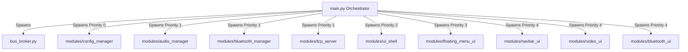
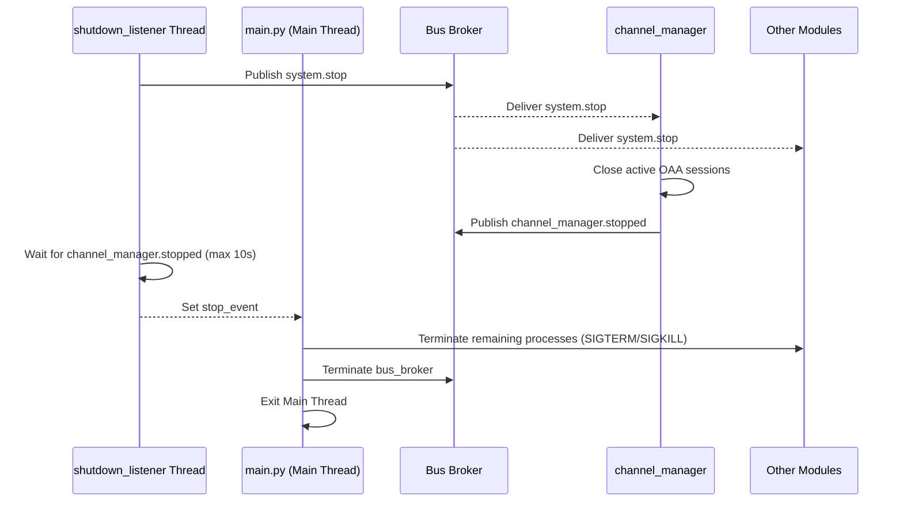

# System Architecture Guide — V2 Multi-Process Architecture

This document describes the architectural design of the **NemoHeadUnit-Wireless V2** platform. It details how the system leverages process isolation, ZeroMQ IPC, zero-copy media transport, and thread-safe UI orchestration to build a robust, modular headunit system.

---

## 1. Process Isolation & Orchestration

To guarantee crash resilience and modularity, NemoHeadUnit-Wireless V2 operates as a **multi-process system**. Rather than running all functions within a single event loop, each major subsystem runs in its own OS process, coordinated by the main entry point `main.py`.



### Multi-Step Priority Boot Sequence

The orchestrator (`main.py`) performs a reactive, multi-step bootstrap to resolve dependencies between services and UI layers.

1. **Broker Initialization**: `main.py` starts `bus_broker.py` and waits `0.5s` for socket bindings to complete.
2. **Subprocess Spawn**: All discovered module processes (`modules/*/main.py`) are launched.
3. **Priority Discovery**:
   - `main.py` publishes `system.readytostart` on the message bus.
   - Every module responds with `system.module_ready {name, priority}` within a 20-second collection window.
   - If a module fails to respond, it is assigned a fallback priority of `1`.
4. **Sequential Level Activation**:
   - For each priority level $P$ (from `0` to `4`):
     - `main.py` publishes `system.start {priority: P}`.
     - `main.py` blocks until it receives `system.ready` from all registered modules of priority level $P$ (with a timeout of 5.0 seconds per module).
     - Once all priority $P$ modules are ready (or timed out), the sequence advances to level $P+1$.

### Priority Level Assignments
| Priority | Target | Purpose |
|---|---|---|
| **0** | `config_manager` | Initialises settings store; provides values for subsequent modules. |
| **1** | `audio_manager`, `bluetooth_manager`, `tcp_server` | Core background services and hardware transport layers. |
| **2** | `ui_shell` | Layout engine, screen geometry coordinator, and input trap. |
| **3** | `floating_menu_ui` | Arc-based navigation launcher (must listen before priority 4 widgets announce themselves). |
| **4** | `navbar_ui`, `video_ui`, `bluetooth_ui`, `config_ui` | Widget rendering processes that display UI panels. |

---

## 2. The ZeroMQ IPC Message Bus

All communication between processes occurs asynchronously via a central ZeroMQ (ZMQ) message bus.

### Broker Topography (`bus_broker.py`)
The broker implements the **XPUB/XSUB pattern** to route messages.
- **XSUB Socket (`ipc:///tmp/nemobus_v2.pub`)**: Binds to receive messages published by all client modules.
- **XPUB Socket (`ipc:///tmp/nemobus_v2.sub`)**: Binds to distribute messages to all subscribed client modules.
- **Message Routing**: Managed via a background thread running `zmq.proxy(xsub, xpub)`.
- **HWM (High Water Mark)**: Set to `5000` to prevent message loss during bursty log outputs or high-throughput media transport.

### Client Wrapper (`shared/bus_client.py`)
Clients interact with the bus through the `BusClient` wrapper class. It handles low-level socket connections, serialization, and background thread execution.

```python
from shared.bus_client import BusClient

# Instantiate client for module
bus = BusClient(module_name="my_module")

# Register subscriber (before calling start)
def on_my_topic(topic, payload):
    print(f"Received from {topic}: {payload}")

bus.subscribe("some.topic", on_my_topic)

# Start background receive loop
bus.start(blocking=False)

# Publish message
bus.publish("some.topic", {"status": "ok"})
```

### Bus Client Instrumentation & Telemetry
Every message published by `BusClient` is automatically injected with a `_trace` header:
```json
{
  "_trace": {
    "src_module": "ui_shell",
    "topic": "ui.widget.geometry",
    "seq": 42,
    "ts_ns": 1716730820000000000
  },
  "name": "navbar_ui",
  "x": 0, "y": 540, "w": 1024, "h": 60
}
```
The receiving `BusClient` extracts this metadata before passing the payload to the subscriber's callback. This telemetry is forwarded via a non-blocking side-channel to `BusTracer` to monitor:
- **Transport Latency**: Time elapsed between publishing and receiving.
- **Sequence Gaps & Rewinds**: Monitoring for packet drops or publisher restarts.
- **High Water Mark Saturation**: Drop alerts (`zmq.Again` exceptions) if HWM is hit.

---

## 3. Zero-Copy Media Transport

For audio and video streams (H.264, AAC), passing large binary buffers wrapped in JSON payloads introduces unacceptable CPU overhead and latency due to base64 encoding/decoding and string parsing.

To solve this, the media pipeline employs **Zero-Copy Multipart ZMQ Frames**:
1. **Header Frame**: Contains JSON metadata describing the frame type, timestamp, sequence number, and length.
2. **Data Frame**: A raw, unencoded byte array containing the binary H.264 NAL unit or AAC frame.

```
+---------------------------------------+
| Frame 0 (JSON Metadata):              |
| {"timestamp_ms": 128943, "key": true} |
+---------------------------------------+
| Frame 1 (Raw Bytes):                  |
| 0x00 0x00 0x00 0x01 0x67 ...          |
+---------------------------------------+
```

By leveraging `zmq.Socket.send_multipart` with memoryviews, the system avoids memory duplication, allowing the CPU to easily sustain $60\text{ fps}$ video decoding and rendering.

---

## 4. PyQt6 Thread Safety & UI Bridge

PyQt6, like most GUI toolkits, is strictly single-threaded. Any attempt to modify a widget's state or geometry directly from a background thread (such as the `BusClient` receive loop) will trigger undefined behavior or a segmentation fault.

To safely bridge ZMQ callbacks and the Qt Event Loop, modules use a thread-safe bridge pattern (e.g., `QtBusBridge` or custom signals):

```python
from PyQt6.QtCore import QObject, pyqtSignal

class BusBridge(QObject):
    # Define custom Qt Signals
    geometry_updated = pyqtSignal(dict)

    def __init__(self, bus_client):
        super().__init__()
        self.bus = bus_client
        self.bus.subscribe("ui.widget.geometry", self._on_geometry)

    def _on_geometry(self, topic, payload):
        # Trigger safe signal emission (cross-thread boundary)
        self.geometry_updated.emit(payload)
```

By subscribing to the Qt signal inside the main thread, the widget can safely update its UI properties:
```python
bridge = BusBridge(bus)
bridge.geometry_updated.connect(widget.update_geometry)
```

---

## 5. Orderly Shutdown Sequence

When a shutdown is initiated (via `Ctrl+C` in the terminal, a system signal, or a `system.shutdown` bus message), the system coordinates an orderly shutdown to avoid resource leaks and orphan processes.



### Shutdown Steps

1. **Signal Catch**: The `shutdown_listener` thread in `main.py` catches the shutdown trigger.
2. **Publish Stop**: It publishes `system.stop` to notify all processes to prepare for exit.
3. **Channel Teardown**:
   - `channel_manager` catches `system.stop`, cleanly terminates active Android Auto projection sessions, closes sockets, and teardowns sub-processes.
   - Once finished, `channel_manager` publishes `channel_manager.stopped`.
4. **Synchronization Barrier**:
   - `main.py` waits up to 10 seconds for `channel_manager.stopped` before proceeding, ensuring the OAA stack closes gracefully.
5. **SIGTERM / SIGKILL Escalation**:
   - `main.py` iterates through all registered modules and calls `terminate()` (SIGTERM).
   - It grants a **grace period** of 10.0 seconds. Any module still running after this window is forcefully ended via `kill()` (SIGKILL).
6. **Broker Teardown**: The broker process is terminated last, releasing IPC resources (`/tmp/nemobus_v2.*`).
