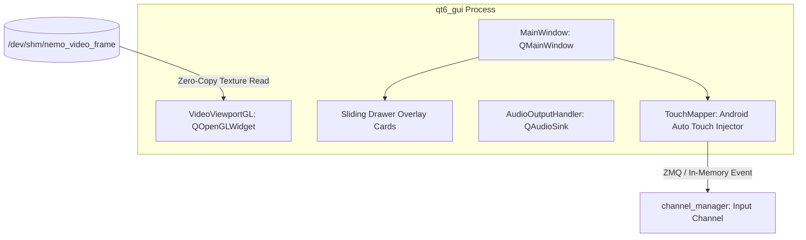

# UI Architecture Guide — NemoHeadUnit-Wireless

This document details the frontend and visual presentation architecture of **NemoHeadUnit-Wireless**. The platform provides two complementary UI display engines:
1. **Native Qt6 GPU Frontend (`backend/modules/qt6_gui`)**: A high-performance, single-window automotive touch interface utilizing OpenGL and Shared Memory (SHM) for low-latency in-vehicle displays.
2. **Web Browser Kiosk Shell (`frontend/`)**: An HTML5 / CSS3 / WebCodecs interface accessible via modern web browsers and embedded browser kiosk runtimes.

---

## 1. Native Qt6 GPU Frontend (`qt6_gui`)

The native interface is implemented in `backend/modules/qt6_gui/` as a unified Priority 5 backend module running inside a dedicated OS process with its own Qt event loop and GIL.

### Key Architectural Elements

1. **Hardware-Accelerated Video Viewport (`VideoViewportGL`)**:
   - Subclasses `QOpenGLWidget` to render incoming Android Auto H.264 video.
   - Reads directly from shared memory (`/dev/shm/nemo_video_frame` on Linux or named memory maps on Windows) to eliminate Python memory copy overhead.
   - Converts YUV/NV12 or RGB surfaces to GPU textures in fragment shaders, sustaining 60 FPS playback.

2. **Overlay Drawer Card System**:
   - Built with sliding drawer widgets that animate over the video viewport without disrupting video rendering.
   - **Settings Drawer**: Head unit preferences, video resolution, execution mode.
   - **Bluetooth Drawer**: Live device scanning, pairing status, connected phone battery and signal indicators.
   - **Phone Drawer**: In-call notifications, PBAP contact list hydration, call answer/hangup actions.
   - **Diagnostics Drawer**: Live bus latency graphs, frame drop counters, memory statistics.
   - **Logs Drawer**: Real-time loguru stream display.

3. **Touch Input Injection (`TouchMapper`)**:
   - Touch and mouse events on `VideoViewportGL` are mapped directly to Android Auto normalized coordinate space ($[0.0, 1.0]$).
   - Injected into `channel_manager` via IPC to drive the connected Android phone's interface with zero perceptible lag.

4. **Integrated Audio Output (`AudioOutputHandler`)**:
   - Receives decoded PCM audio chunks from `channel_manager` over IPC.
   - Routes media, navigation speech, and system alerts to system audio devices via `QAudioSink`.

---

## 2. Web Browser Kiosk Shell (`frontend/`)

For lightweight or browser-based deployments, the project provides a web application served by the `proxy` module on port `8000`.

### Components & Technologies
- **Structure**: Vanilla HTML5 (`frontend/index.html`).
- **Styling**: Modular CSS (`frontend/css/style.css`, `frontend/css/theme.css`).
- **Video Decoding**: Browser-native `WebCodecs` (`VideoDecoder` API) in `frontend/js/video_renderer.js`, receiving NAL units over WebSocket.
- **Audio Playback**: Web Audio API `AudioContext` streaming PCM/AAC chunks with dynamic drift compensation.
- **Dynamic 2x2 Dashboard**: Disconnected home screen showing turn-by-turn navigation cards, active phone call cards, and analog clock.
- **Kiosk Mode Launchers**: Launch scripts in `scripts/launch_kiosk.sh` and `scripts/launch_kiosk.bat` launch Chromium or Edge in `--kiosk` borderless fullscreen mode.
