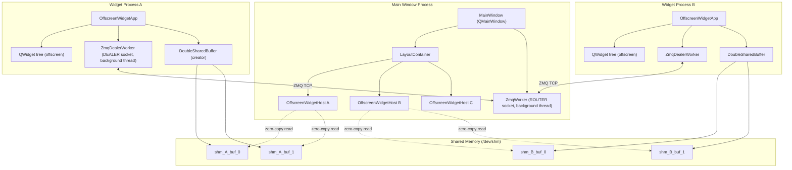
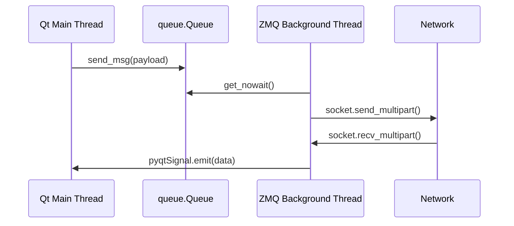
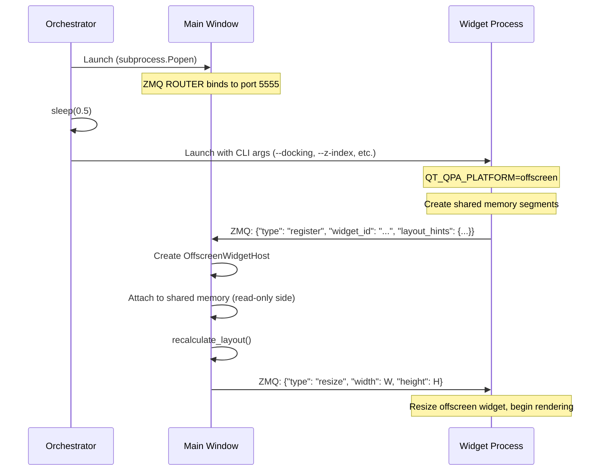
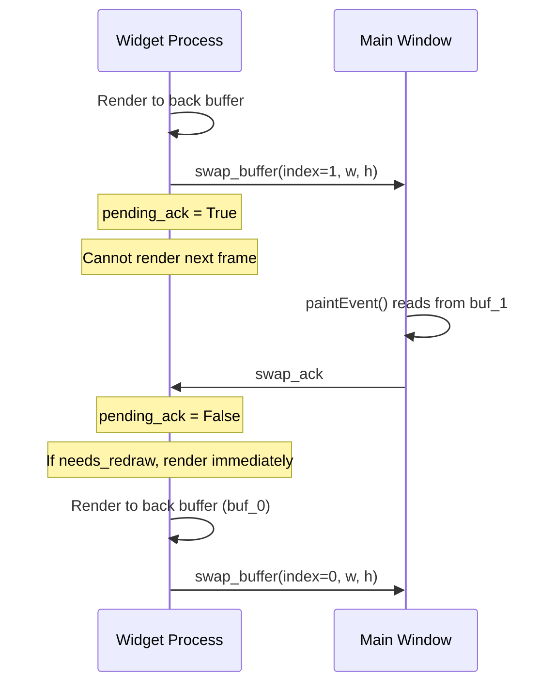
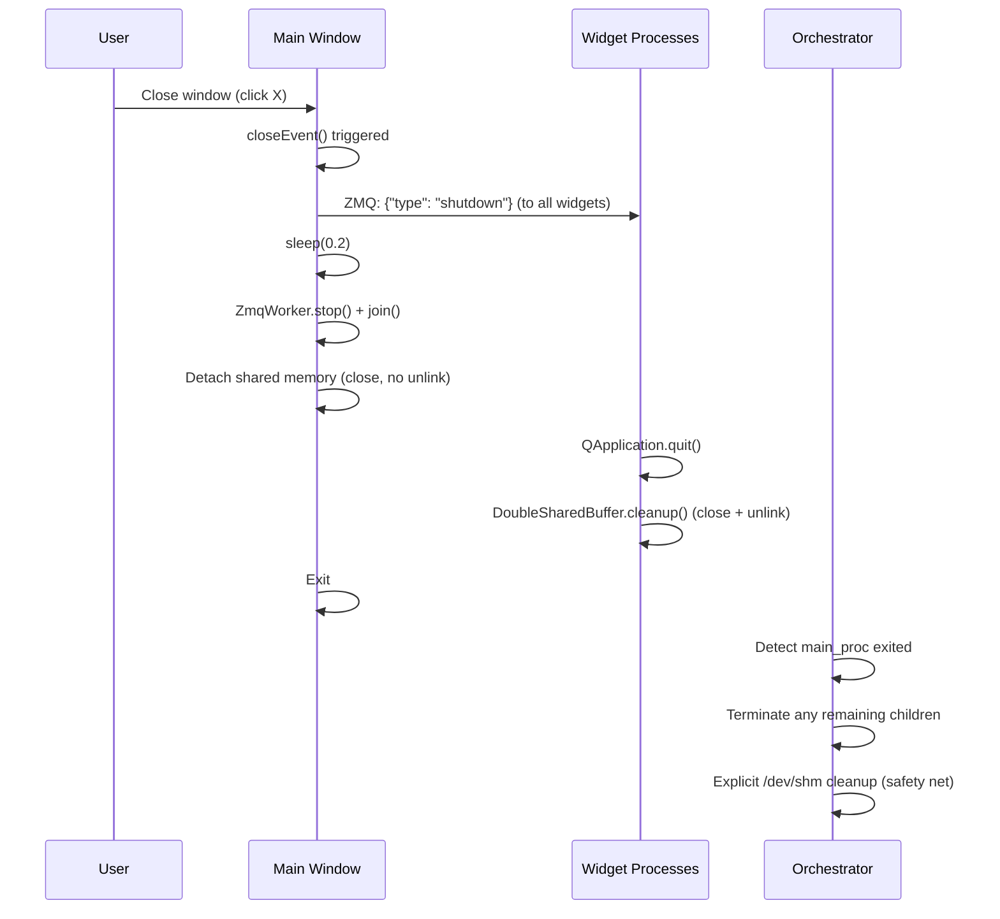

# Multiprocess UI Integration: Technical Design Paper

**Version:** 1.0
**Date:** 2026-06-26
**Tech Stack:** Python 3.14, PyQt6, ZeroMQ (pyzmq), POSIX Shared Memory
**Repository:** `proof_of_concept/`

---

## Table of Contents

1. [Executive Summary](#1-executive-summary)
2. [Architecture Overview](#2-architecture-overview)
3. [Process Roles & Responsibilities](#3-process-roles--responsibilities)
4. [Zero-Copy Shared Memory Framebuffer](#4-zero-copy-shared-memory-framebuffer)
5. [ZeroMQ Message Bus Protocol](#5-zeromq-message-bus-protocol)
6. [Widget Registration & Lifecycle](#6-widget-registration--lifecycle)
7. [Layout Engine: Priority-Based Docking](#7-layout-engine-priority-based-docking)
8. [Input Event Routing](#8-input-event-routing)
9. [Frame Delivery & Flow Control](#9-frame-delivery--flow-control)
10. [Qt Layout Feedback Loop Prevention](#10-qt-layout-feedback-loop-prevention)
11. [Heartbeat & Health Monitoring](#11-heartbeat--health-monitoring)
12. [Graceful Shutdown & Resource Cleanup](#12-graceful-shutdown--resource-cleanup)
13. [Pitfalls, Gotchas & Lessons Learned](#13-pitfalls-gotchas--lessons-learned)
14. [File Reference](#14-file-reference)
15. [Upgrading an Existing Application](#15-upgrading-an-existing-application)

---

## 1. Executive Summary

This document describes a **multiprocess GUI composition architecture** where independent OS processes each render a Qt widget **offscreen** into shared memory, and a single **collector process** composites their pixel output into one visible window. The user interacts only with the collector window; all mouse, keyboard, and touch events are transparently routed to the correct remote widget process over a ZeroMQ message bus.

### Why this pattern?

| Concern | How this architecture solves it |
|---|---|
| **Process isolation** | A crash in one widget module does not take down the main window or other widgets. |
| **Independent deployment** | Widget modules can be updated, restarted, or replaced without restarting the main application. |
| **Zero-copy rendering** | Pixel data never crosses a serialization boundary; both sides wrap the same physical memory page in a `QImage`. |
| **Language/framework agnostic** | Any process that can write ARGB32 pixels to shared memory and speak JSON over ZMQ can participate. |
| **Decoupled lifecycles** | Widgets can join and leave at any time. The main window dynamically adapts its layout. |

---

## 2. Architecture Overview



### Data flow summary

1. **Control plane** (ZMQ, JSON): registration, geometry commands, input events, heartbeats, shutdown signals.
2. **Data plane** (shared memory, zero-copy): raw ARGB32 pixel buffers. No pixels ever travel over ZMQ.

---

## 3. Process Roles & Responsibilities

### 3.1 Main Window Process ([main_window.py](file:///home/nemo/proof_of_concept/main_window.py))

| Responsibility | Implementation |
|---|---|
| Display the visible window | `MainWindow(QMainWindow)` with a `CentralWidget` and `LayoutContainer` |
| Accept widget registrations | `ZmqWorker` (ROUTER socket) receives `register` messages, emits Qt signal |
| Compute widget placement | `recalculate_layout()` with `solve_dimensions()` |
| Paint remote frames | `OffscreenWidgetHost.paintEvent()` reads from shared memory via `QImage` |
| Route user input | Mouse/keyboard/touch handlers on `OffscreenWidgetHost` serialize events and send via ZMQ |
| Manage lifecycle | `closeEvent()` sends shutdown, waits, cleans up shared memory |

### 3.2 Offscreen Widget Process ([offscreen_widget.py](file:///home/nemo/proof_of_concept/offscreen_widget.py))

| Responsibility | Implementation |
|---|---|
| Run Qt in headless mode | `os.environ["QT_QPA_PLATFORM"] = "offscreen"` before `QApplication` |
| Build a real QWidget tree | Standard PyQt6 widgets with layouts, styles, signals/slots |
| Create shared memory | `DoubleSharedBuffer(widget_id, create=True)` |
| Register with main window | Send `register` message with layout hints on startup |
| Render to shared memory | `widget.render(qimage)` where `qimage` wraps shared memory |
| Receive and replay input | Reconstruct `QMouseEvent`/`QKeyEvent`/`QTouchEvent` from JSON, post to widget tree |
| Send heartbeats | Periodic `ping` messages; expect `pong` replies |

### 3.3 Orchestrator Process ([run.py](file:///home/nemo/proof_of_concept/run.py))

| Responsibility | Implementation |
|---|---|
| Launch all processes | `subprocess.Popen` for main window and each widget |
| Pass configuration | CLI arguments: `--docking`, `--z-index`, `--priority`, size constraints |
| Monitor health | Poll loop checks if child processes have exited |
| Clean shutdown | `SIGTERM` → `SIGKILL` fallback; explicit `/dev/shm` cleanup |

---

## 4. Zero-Copy Shared Memory Framebuffer

### 4.1 The Problem

Transferring a full 1920×1080 ARGB32 frame (≈8 MB) per render tick over a socket would be prohibitively slow. We need the widget process to write pixels and the main window to read them without any memory copy.

### 4.2 The Solution: POSIX Shared Memory + QImage Wrapping

The key insight is that Python's `multiprocessing.shared_memory.SharedMemory` maps a region of `/dev/shm` into the process's virtual address space. We extract the **raw pointer** to that region using `ctypes` and construct a `QImage` that wraps it directly:

```python
# Get the raw memory address
address = ctypes.addressof(ctypes.c_char.from_buffer(shm.buf))

# Wrap it in a QImage — no copy occurs
img = QImage(address, width, height, pitch, QImage.Format.Format_ARGB32)
```

> [!IMPORTANT]
> The `QImage` constructor that accepts an integer address **does not copy** the pixel data. It wraps the pointer directly. Any modification to the `QImage` modifies the shared memory, and vice versa. Both processes see the same physical memory pages via the kernel's page table mapping.

### 4.3 Double Buffering

We allocate **two** shared memory segments per widget (`buf_0` and `buf_1`). While the widget process writes to the **back buffer**, the main window reads from the **front buffer**. After rendering completes, the widget swaps which buffer index it reports as active.

```
Widget Process                     Main Window Process
─────────────                      ────────────────────
Render into buf_1                  Paint from buf_0
   ↓                                  ↓
Send swap_buffer(index=1)  ──→    Receive: switch to buf_1
   ↓                                  ↓
Render into buf_0 (next)           Paint from buf_1
```

### 4.4 Physical vs. Logical Dimensions

The shared memory is allocated at a **fixed physical size** (default: 1920×1080 × 4 bytes = ~8 MB per buffer). The **logical rendering viewport** is smaller and changes dynamically when the main window resizes.

The `QImage` is constructed with:
- `width` / `height`: the current logical dimensions
- `pitch` (bytesPerLine): always `max_width × 4`, matching the physical row stride

This means only the top-left `width×height` rectangle of the buffer is used for pixel data. The rest is padding. This avoids reallocating shared memory on every resize.

> [!WARNING]
> The `pitch` parameter is critical. If `bytesPerLine` does not match the physical row width, pixel rows will be misaligned and the image will appear sheared/corrupted. Always use `max_width * 4` regardless of the logical width.

### 4.5 Naming Convention

Shared memory segments are named deterministically:

```
/dev/shm/poc_shm_{widget_id}_buf_0
/dev/shm/poc_shm_{widget_id}_buf_1
```

This allows the main window to attach by name after receiving the `widget_id` in the registration message, and allows the orchestrator to clean up orphaned segments.

### 4.6 Resource Tracker Patch

Python's `multiprocessing.resource_tracker` treats shared memory as a process-local resource and will emit warnings (or prematurely unlink segments) when a process exits without explicitly calling `unlink()`. Since we intentionally share segments across processes, we **patch the resource tracker** to ignore `shared_memory`-type resources:

```python
def patch_resource_tracker():
    from multiprocessing import resource_tracker
    orig_register = resource_tracker.register
    def patched_register(name, rtype):
        if rtype == "shared_memory":
            return  # Skip tracking
        return orig_register(name, rtype)
    resource_tracker.register = patched_register
    # ... same for unregister
```

> [!CAUTION]
> Without this patch, you will see `UserWarning: resource_tracker: There appear to be N leaked shared_memory objects` on every shutdown. Worse, the tracker may unlink segments while the other process is still using them, causing segfaults.

---

## 5. ZeroMQ Message Bus Protocol

### 5.1 Socket Topology

| Side | Socket Type | Role |
|---|---|---|
| Main Window | `zmq.ROUTER` | Server. Binds to `tcp://127.0.0.1:5555`. Knows which client sent each message via the routing identity frame. |
| Each Widget | `zmq.DEALER` | Client. Connects to the ROUTER. Sets `zmq.IDENTITY` to the `widget_id` string. |

The ROUTER/DEALER pattern gives us:
- **Bidirectional async messaging** (both sides can send at any time)
- **Identity-based routing** (the ROUTER can address replies to specific DEALERs)
- **No broker needed** (direct connection)

### 5.2 Wire Format

All messages are JSON-encoded UTF-8 strings carried inside ZMQ multipart frames.

**DEALER → ROUTER** frame layout:
```
Frame 0: b""           (empty delimiter, required by DEALER/ROUTER convention)
Frame 1: JSON payload   (UTF-8 bytes)
```

**ROUTER → DEALER** frame layout:
```
Frame 0: client_id      (binary identity of the target DEALER)
Frame 1: b""           (empty delimiter)
Frame 2: JSON payload   (UTF-8 bytes)
```

### 5.3 Message Types

#### Client → Server (Widget → Main Window)

| Message | Fields | Description |
|---|---|---|
| `register` | `widget_id`, `layout_hints` | Widget announces itself and its layout constraints |
| `swap_buffer` | `widget_id`, `buffer_index`, `width`, `height` | Widget has finished rendering; tells main window which buffer to read |
| `ping` | `widget_id` | Heartbeat (sent every 1 second) |

#### Server → Client (Main Window → Widget)

| Message | Fields | Description |
|---|---|---|
| `resize` | `width`, `height` | Main window tells widget its new viewport dimensions |
| `input` | `event` (nested dict) | Serialized mouse/keyboard/touch event |
| `pong` | (none) | Heartbeat reply |
| `swap_ack` | `widget_id` | Acknowledges that the main window has consumed the swapped buffer |
| `shutdown` | (none) | Tells the widget to exit cleanly |

### 5.4 Threading Model

ZMQ sockets are **not thread-safe**. Both the main window and widget processes use a dedicated **background thread** (`ZmqWorker` / `ZmqDealerWorker`) that owns the socket. Communication between the ZMQ thread and the Qt GUI thread happens via:

- **Inbound (ZMQ → Qt):** `pyqtSignal` emissions from the background thread, which Qt's event loop delivers to connected slots on the main thread.
- **Outbound (Qt → ZMQ):** A thread-safe `queue.Queue`. The Qt thread calls `send_msg()` which enqueues; the ZMQ thread dequeues and sends.



> [!IMPORTANT]
> All ZMQ `send_multipart` calls use `flags=zmq.NOBLOCK` to prevent the background thread from blocking if the send buffer is full. This is critical because a blocking send can starve the GIL, preventing the Qt main thread from processing events (including heartbeat replies).

---

## 6. Widget Registration & Lifecycle

### 6.1 Startup Sequence



### 6.2 Layout Hints

When a widget registers, it sends a `layout_hints` dictionary with the following optional fields:

| Field | Type | Default | Description |
|---|---|---|---|
| `docking` | string | `"center"` | Placement rule: `left`, `right`, `top`, `bottom`, `top-left`, `top-right`, `bottom-left`, `bottom-right`, `center` |
| `z_index` | int | `0` | Layer number. Higher layers are drawn on top. All widgets on the same layer share the same available space. |
| `priority` | int | `0` | Within a layer, higher-priority widgets are placed first and get the more desirable outer positions. |
| `min_width` | int or null | null | Minimum width in pixels |
| `min_height` | int or null | null | Minimum height in pixels |
| `max_width` | int or null | null | Maximum width in pixels |
| `max_height` | int or null | null | Maximum height in pixels |
| `aspect_ratio` | float or null | null | `width / height` ratio. When set, the widget's dimensions are constrained to maintain this ratio. |

### 6.3 Dynamic Registration

Widgets can register at any time. The main window dynamically creates an `OffscreenWidgetHost` for each new `widget_id` and recalculates the layout. If a widget re-registers (e.g., after a restart), the existing host is reused and its client identity is updated.

---

## 7. Layout Engine: Priority-Based Docking

### 7.1 Conceptual Model

The layout engine works like a **space-slicing algorithm**. Each layer starts with the full container rectangle `R`. Widgets are placed one at a time in priority order. Each placement **consumes space** from `R`, shrinking it for subsequent widgets.

### 7.2 Algorithm

```
for each layer (sorted by z_index ascending):
    R = full container rectangle

    for each widget in layer (sorted by -priority, then registration order):
        (w, h) = solve_dimensions(R.width, R.height, widget.hints)

        Place widget according to its docking direction:
            left:         position at R.left edge, slice R.left += w
            right:        position at R.right edge, slice R.right -= w
            top:          position at R.top edge, slice R.top += h
            bottom:       position at R.bottom edge, slice R.bottom -= h
            top-left:     position at R.top-left corner, slice both R.left and R.top
            top-right:    position at R.top-right corner, slice both R.right and R.top
            bottom-left:  position at R.bottom-left corner, slice both R.left and R.bottom
            bottom-right: position at R.bottom-right corner, slice both R.right and R.bottom
            center:       position at R.center, do NOT slice R

    Raise all widgets in this layer (z-order stacking)
```

### 7.3 The Constraint Solver: `solve_dimensions()`

This function resolves the final `(width, height)` for a widget given the available space and the widget's size/aspect-ratio constraints.

**Without aspect ratio:** Simply clamp `target_w` and `target_h` to `[min, max]` ranges.

**With aspect ratio (`ar = w/h`):**

1. Compute the valid range for height `[h_min, h_max]` by combining height constraints with width constraints converted through the aspect ratio:
   - `h_min = max(min_height, min_width / ar)`
   - `h_max = min(max_height, max_width / ar)`

2. Compute the target height that fits the available space while respecting the aspect ratio:
   - `target_h = min(available_height, available_width / ar)`

3. Clamp `target_h` into `[h_min, h_max]`

4. Derive width: `w = h × ar`

### 7.4 Layer Independence

> [!IMPORTANT]
> Each layer starts with the **full container rectangle**, not the leftover from the previous layer. This is intentional: layers are independent overlapping planes. A status overlay on layer 1 can overlap widgets on layer 0.

### 7.5 Corner Docking

Corner docking (e.g., `top-right`) slices **both** dimensions of `R` simultaneously. This means a widget docked `top-right` will prevent subsequent widgets from using both the right edge and the top edge of the remaining space.

---

## 8. Input Event Routing

### 8.1 Overview

The main window captures all user input (mouse, keyboard, touch) on each `OffscreenWidgetHost` QWidget. It serializes the event to JSON, sends it over ZMQ to the corresponding widget process, which reconstructs a real Qt event and posts it into its offscreen widget tree.

### 8.2 Mouse Events

**Serialization (Main Window side):**

```python
{
    "type": "input",
    "event": {
        "type": "MousePress" | "MouseRelease" | "MouseMove",
        "x": <int>,          # clamped to [0, host.width()]
        "y": <int>,          # clamped to [0, host.height()]
        "button": <int>,     # Qt.MouseButton enum value
        "buttons": <int>,    # Currently pressed buttons bitmask
        "modifiers": <int>   # Qt.KeyboardModifier bitmask
    }
}
```

**Reconstruction (Widget side):**

```python
ev = QMouseEvent(qt_type, QPointF(local_pos), button, buttons, modifiers)
QCoreApplication.postEvent(target, ev)
```

### 8.3 Coordinate Clamping

> [!IMPORTANT]
> Mouse coordinates are **clamped** to the host widget's bounds before transmission. This is critical for drag operations: if the user drags a slider and the cursor moves outside the host widget's boundaries, the clamped coordinates ensure the slider moves to its min/max position rather than receiving out-of-bounds coordinates that Qt would reject or misroute.

### 8.4 Mouse Capture (Drag Continuity)

When a user presses a mouse button on a child widget (e.g., a slider handle) and drags, the event stream must continue to target **that same child widget** even if the cursor moves over a different child or outside the widget entirely.

**Rule:** On `MousePress`, the widget process resolves the target child via `widget.childAt(x, y)` and stores it as `captured_widget`. All subsequent `MouseMove` events are routed to `captured_widget` regardless of coordinate position. On `MouseRelease` (when all buttons are released), the capture is cleared.

```python
if etype == "MousePress":
    target = self.widget.childAt(x, y) or self.widget
    self.captured_widget = target
elif self.captured_widget:
    target = self.captured_widget        # Sticky target during drag
else:
    target = self.widget.childAt(x, y)   # Normal hover routing

# Convert to local coordinates relative to the target widget
local_pos = target.mapFrom(self.widget, QPoint(x, y))
```

### 8.5 Keyboard Events

Keyboard events are routed to the currently focused widget within the offscreen widget tree:

```python
target = QApplication.focusWidget()
if not target:
    target = self.widget   # fallback to root widget
```

Focus is transferred on `MousePress` if the target widget has an appropriate `focusPolicy`.

### 8.6 Touch Events

Touch event handling has two paths:

1. **Native touch path:** If the target widget (or any ancestor) has `WA_AcceptTouchEvents`, a real `QTouchEvent` is constructed and posted.

2. **Touch-to-mouse fallback:** If no widget in the hierarchy accepts touch events, the first touch point is synthesized into a `QMouseEvent` (press/move/release). This ensures standard Qt widgets (buttons, sliders, text inputs) work correctly with touch input without requiring any modification.

The touch-to-mouse synthesis also implements **mouse capture semantics** to ensure drag continuity during touch interactions.

---

## 9. Frame Delivery & Flow Control

### 9.1 The Flickering Problem

Without flow control, the widget process can render and swap buffers faster than the main window can paint them. This causes:
- The widget writes into a buffer that the main window is currently reading → **tearing**
- Multiple swap messages queue up, causing the main window to skip frames → **visual stuttering**

### 9.2 The Solution: Acknowledge-Based Flow Control

The system implements a **stop-and-wait** protocol:



**Key state variables in the widget process:**

| Variable | Type | Purpose |
|---|---|---|
| `pending_ack` | bool | True if we've sent a `swap_buffer` and are waiting for `swap_ack` |
| `needs_redraw` | bool | True if a render was requested while `pending_ack` was True |
| `active_idx` | int | The buffer index we last wrote to (and reported to the main window) |

**The render gate logic:**

```python
def render_and_swap(self):
    if self.pending_ack:
        self.needs_redraw = True   # Remember that we need to redraw
        return                     # But don't render now

    self.pending_ack = True
    self.needs_redraw = False

    back_idx = 1 - self.active_idx
    img = self.shm_buffer.get_image(back_idx, self.current_w, self.current_h)
    img.fill(Qt.GlobalColor.transparent)
    self.widget.render(img)
    self.active_idx = back_idx

    self.worker.send_msg({"type": "swap_buffer", ...})
```

> [!TIP]
> This pattern ensures that at most **one frame** is in-flight between the widget and main window at any time. The widget never writes to a buffer the main window might be reading.

---

## 10. Qt Layout Feedback Loop Prevention

### 10.1 The Problem

When the main window calls `host.setGeometry()` to position an `OffscreenWidgetHost`, Qt's internal C++ implementation triggers `updateGeometry()` on the host widget. This propagates **upward** through the parent chain (`LayoutContainer` → `CentralWidget` → `MainWindow`), eventually reaching the window manager. The window manager may respond with a `Resize` event, which triggers `recalculate_layout()` again, creating an **infinite feedback loop**.

This loop manifests as:
- The main window continuously resizing by 1–2 pixels
- CPU usage pegging at 100%
- GIL starvation that prevents the ZMQ background thread from processing heartbeats
- Widget processes timing out and shutting down

### 10.2 The Solution: Three-Layer Defense

**Layer 1: Swallow `LayoutRequest` events**

All three container classes (`LayoutContainer`, `CentralWidget`, `MainWindow`) override `event()` to intercept and swallow `QEvent.Type.LayoutRequest`:

```python
def event(self, event):
    if event.type() == QEvent.Type.LayoutRequest:
        return True   # Consumed; do not propagate
    return super().event(event)
```

**Layer 2: Override `updateGeometry()` to no-op**

`LayoutContainer` overrides `updateGeometry()` to do nothing. This blocks the synchronous C++-level geometry propagation that bypasses the Qt event loop:

```python
class LayoutContainer(QWidget):
    def updateGeometry(self):
        pass   # Block bottom-up size constraint propagation
```

**Layer 3: Ignored size policies**

All custom containers and hosts use `QSizePolicy.Policy.Ignored`, and override `sizeHint()` / `minimumSizeHint()` to return passive values:

```python
self.setSizePolicy(QSizePolicy.Policy.Ignored, QSizePolicy.Policy.Ignored)

def sizeHint(self):
    return self.size()         # "I am whatever size I already am"

def minimumSizeHint(self):
    return QSize(100, 100)     # Reasonable floor, won't drive resizing
```

> [!CAUTION]
> This is the single hardest problem in this architecture. If you add a `QLayout` to the `LayoutContainer`, or forget to override `updateGeometry()`, the feedback loop will silently return. The symptoms (heartbeat timeouts, widget crashes) appear unrelated to the root cause, making debugging extremely difficult.

---

## 11. Heartbeat & Health Monitoring

### 11.1 Mechanism

Each widget process sends a `ping` message every **1 second**. The main window's ZMQ worker immediately replies with `pong`. The widget tracks the timestamp of the last received `pong`.

### 11.2 Timeouts

| Parameter | Value | Rationale |
|---|---|---|
| Ping interval | 1.0 s | Frequent enough to detect failures quickly |
| Initial grace period | 15.0 s | Allows time for all processes to start, register, and stabilize |
| Pong timeout | 10.0 s | Tolerant of temporary GIL contention or system load spikes |

If the widget does not receive a `pong` within the timeout window, it assumes the main window has crashed or become unreachable, emits a shutdown signal, and exits.

### 11.3 Why generous timeouts matter

During startup, the main window's Qt event loop is busy processing `show()`, initial `resizeEvent`, and widget registration signals. The ZMQ background thread may not get scheduled promptly due to Python's GIL. A tight timeout (e.g., 3 seconds) will cause false positives where perfectly healthy widget processes suicide during startup.

---

## 12. Graceful Shutdown & Resource Cleanup

### 12.1 Normal Shutdown (user closes window)



### 12.2 Shared Memory Ownership Rules

| Action | Creator (Widget) | Consumer (Main Window) |
|---|---|---|
| `shm.close()` | ✅ Always | ✅ Always |
| `shm.unlink()` | ✅ Only creator | ❌ Never |

The orchestrator (`run.py`) provides a **safety net** by explicitly unlinking any leftover `/dev/shm/poc_shm_*` files after all processes have exited, preventing accumulation of orphaned segments across crashes.

### 12.3 Signal Handling

The main window installs handlers for `SIGINT` and `SIGTERM` that trigger `window.close()`, ensuring `closeEvent()` runs even when the process is terminated from the orchestrator or via Ctrl+C.

A `QTimer` firing every 100ms ensures Python's signal handlers get a chance to execute, since Qt's event loop normally doesn't yield to the Python interpreter:

```python
timer = QTimer()
timer.start(100)
timer.timeout.connect(lambda: None)   # Just return control to Python briefly
```

---

## 13. Pitfalls, Gotchas & Lessons Learned

### 13.1 GIL Starvation

**Problem:** Python's Global Interpreter Lock means only one thread runs Python code at a time. If the Qt main thread is processing a flood of events (e.g., during a resize loop), the ZMQ background thread cannot run. This starves heartbeat processing.

**Mitigation:**
- Use `zmq.NOBLOCK` for all sends
- Generous heartbeat timeouts
- Prevent the layout feedback loop (Section 10)

### 13.2 QCoreApplication vs QApplication

**Problem:** `QCoreApplication.focusWidget()` does not exist; it's `QApplication.focusWidget()`. This is a common mistake when porting between widget types.

**Rule:** Always use `QApplication.focusWidget()` in widget processes.

### 13.3 Offscreen Platform Plugin

**Problem:** Widget processes must not try to create visible windows.

**Solution:** Set `os.environ["QT_QPA_PLATFORM"] = "offscreen"` **before** importing any PyQt modules. This must happen at the module level, before `QApplication` is created.

### 13.4 `propagateSizeHints()` Warning

**Message:** `This plugin does not support propagateSizeHints()`

**Explanation:** The offscreen platform plugin doesn't implement window manager integration. This warning is harmless and expected.

### 13.5 Wayland Connection Breakage

**Message:** `The Wayland connection broke during blocking read event. Did the Wayland compositor die?`

**Explanation:** Under Wayland, when the user closes the window, the compositor destroys the surface before Qt fully processes the close. This is a cosmetic warning, not an error. The shutdown path still executes correctly.

### 13.6 Shared Memory Segment Leaks

**Symptom:** Accumulated files in `/dev/shm/` after repeated crash-restart cycles.

**Prevention:**
1. The widget process attempts to clean up orphaned segments on startup (try attach → close → unlink)
2. The orchestrator explicitly unlinks all known segment names on exit
3. Monitor `/dev/shm/poc_shm_*` in production

### 13.7 Integer Pitch Alignment

**Problem:** `QImage` requires `bytesPerLine` (pitch) to be specified correctly. If you pass `logical_width * 4` instead of `max_width * 4`, the image will render correctly only when the widget fills the full buffer width. At any other size, rows will be misaligned.

**Rule:** Always use `max_width * 4` as the pitch, regardless of the current logical width.

---

## 14. File Reference

| File | Lines | Purpose |
|---|---|---|
| [main_window.py](file:///home/nemo/proof_of_concept/main_window.py) | 573 | Main window process: ZMQ server, layout engine, input routing, frame composition |
| [offscreen_widget.py](file:///home/nemo/proof_of_concept/offscreen_widget.py) | 639 | Widget process: offscreen rendering, input replay, heartbeat client |
| [shared_buffer.py](file:///home/nemo/proof_of_concept/shared_buffer.py) | 115 | Double-buffered shared memory abstraction with QImage wrapping |
| [run.py](file:///home/nemo/proof_of_concept/run.py) | 113 | Process orchestrator: launch, monitor, cleanup |

### Key Classes

| Class | File | Role |
|---|---|---|
| `ZmqWorker` | main_window.py | ROUTER socket background thread (server side) |
| `ZmqWorkerSignals` | main_window.py | Qt signals bridge: ZMQ thread → Qt main thread |
| `LayoutContainer` | main_window.py | Custom container that suppresses layout feedback loops |
| `OffscreenWidgetHost` | main_window.py | Per-widget proxy: paints shared memory, captures input |
| `MainWindow` | main_window.py | Top-level window, layout orchestration, lifecycle management |
| `ZmqDealerWorker` | offscreen_widget.py | DEALER socket background thread (client side) |
| `OffscreenWidgetApp` | offscreen_widget.py | Widget-side controller: rendering, input replay, flow control |
| `DoubleSharedBuffer` | shared_buffer.py | Shared memory allocation, QImage wrapping, cleanup |

---

## 15. Upgrading an Existing Application

### Step 1: Identify modules to extract

Determine which parts of your existing application should run as separate processes. Good candidates:
- Computationally expensive visualizations (3D views, charts, video players)
- Third-party components with different stability guarantees
- Components that could benefit from independent update/restart cycles

### Step 2: Extract the widget into a standalone process

1. Copy `shared_buffer.py` into your project.
2. Create a new entry point (like `offscreen_widget.py`) for each extracted module.
3. Set `QT_QPA_PLATFORM=offscreen` at the top of the file.
4. Wrap your existing widget in an `OffscreenWidgetApp`-like controller that handles:
   - Registration with layout hints
   - Resize commands
   - Input event reconstruction and dispatch
   - Render-and-swap with flow control

### Step 3: Add the host infrastructure to your main window

1. Copy the `ZmqWorker`, `ZmqWorkerSignals`, `OffscreenWidgetHost`, and `LayoutContainer` classes.
2. Integrate `LayoutContainer` into your existing layout hierarchy.
3. Connect the `registered` and `buffer_swapped` signals.
4. Implement or adapt `recalculate_layout()` to your application's layout rules.

### Step 4: Suppress layout feedback loops

This is the step most likely to be missed and most likely to cause mysterious failures:
- Override `event()` on every container in the chain to swallow `LayoutRequest`
- Override `updateGeometry()` on the container holding the hosts
- Set `QSizePolicy.Policy.Ignored` on all host widgets
- Override `sizeHint()` and `minimumSizeHint()` to return passive values

### Step 5: Wire up the orchestrator

Adapt `run.py` to launch your specific widget modules with appropriate CLI arguments for layout hints.

### Step 6: Test thoroughly

- Verify layout stability during rapid window resizing
- Verify input routing with drag operations that cross widget boundaries
- Verify clean shutdown with no leaked `/dev/shm` segments
- Verify recovery from widget process crashes (heartbeat timeout → main window continues)
- Test with touch input if applicable

---

> [!NOTE]
> This architecture is designed as a **composition pattern**, not a framework. The proof of concept deliberately uses minimal abstractions to make every mechanism explicit and auditable. When integrating into a production application, consider wrapping the boilerplate (ZMQ setup, signal bridging, shared memory management) into reusable base classes while preserving the explicit flow control and layout suppression patterns.
